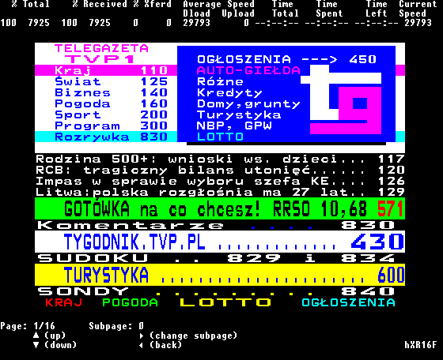

<p align="center">
	<b>Teletext Client</b>
	<br>
	<i>Fast and simple teletext client.</i>
	<br><br><br>
	
</p>

# Usage
Run by double-clicking:
> src/Teletext-Client.bat

Use arrow keys to navigate.

# Types of teletexts:
1. **TVP** - Polish teletext

To change type of teletext replace preselected type in **Teletext-Client.bat**:<br>
```batchfile
 9. :: Type of teletext
10. set "type=TVP"
```

Currently only one type is available.
